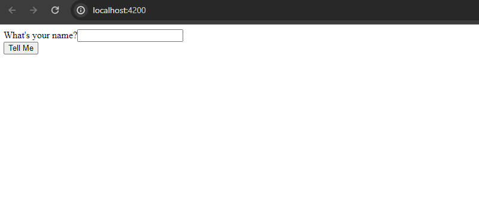
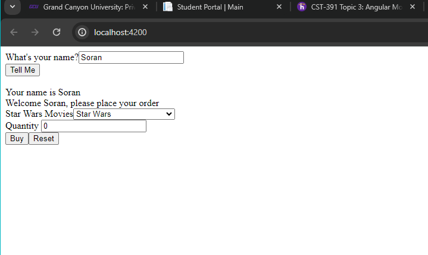
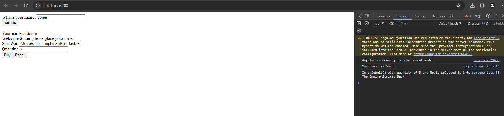
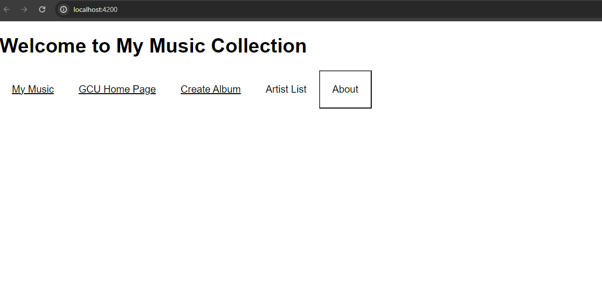
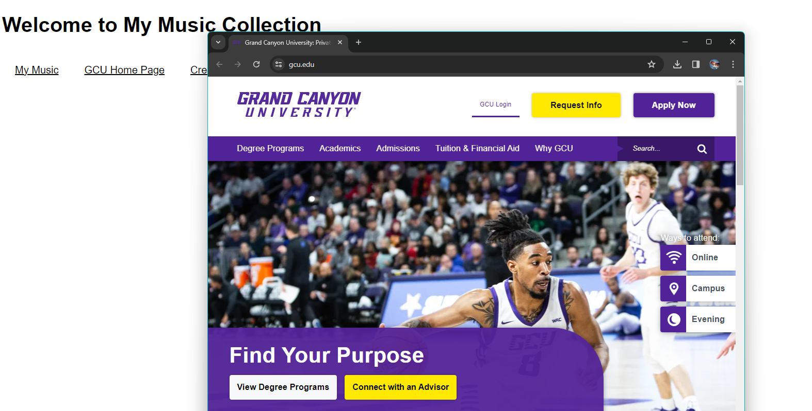
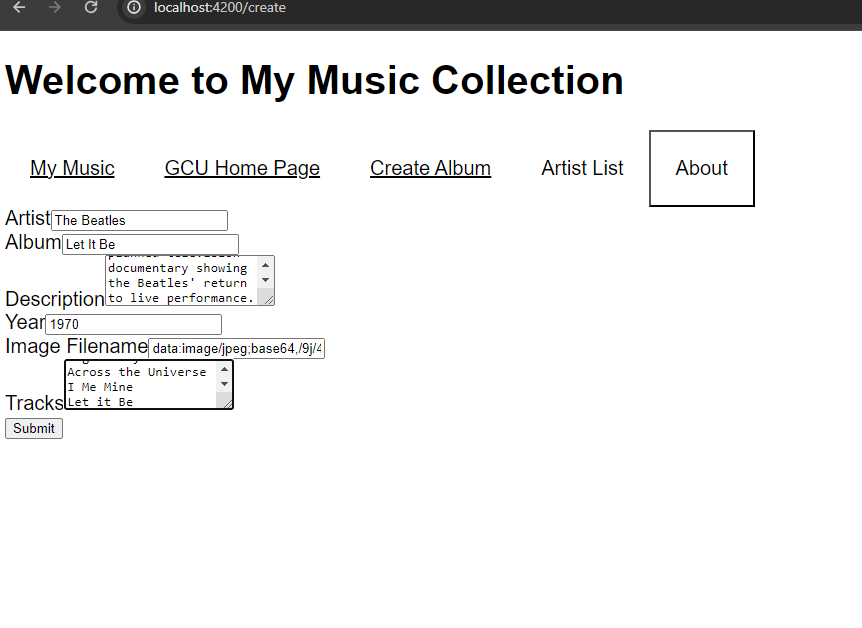
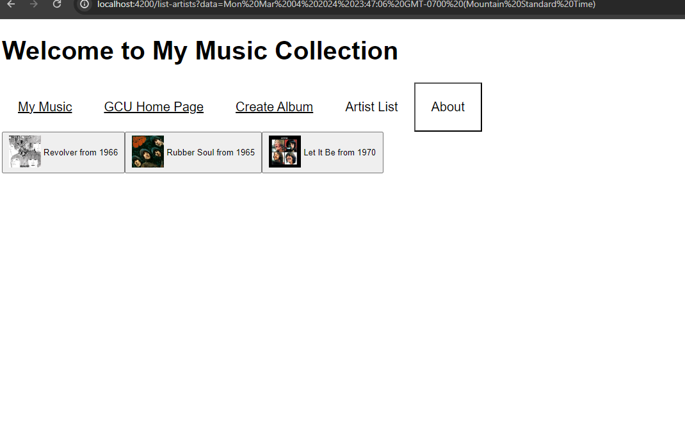
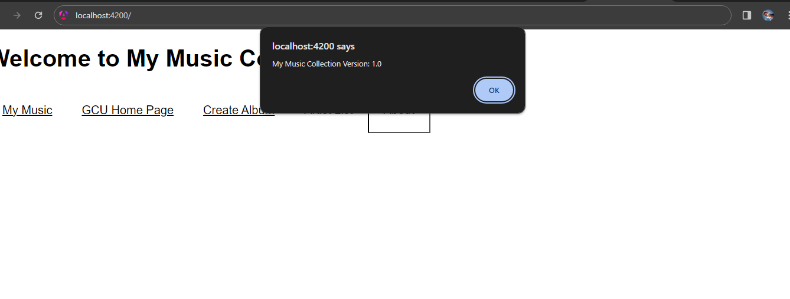

# Activity 3 Angular 

## Executive Summary

### Part 1:
- In this activiy, the simpleapp was created by using the ng new simpleapp using VS terminal and selectiong the Angular route and CSS option. ng serve --o command was used to run the testapp which the browser aotumatically opned the simpleapp. Afer modifying the angulare.json and app.component.htm using bootstrap.

#### Part 1 Screenshots:

- This screen shows the PC size webpage after using ng serve --o to run the app. 

- This screen shows the responsive of webpage for different screen size which here iPhone 12 pro was demonstrated. 

- This screen shows the web pade of application at first run and before the name was entred.

- This screen shows the page after the user enters their name.

- This screen shows after the user clicked the Buy button with the Dev tools with quantity and product.

### Research Questions:
#### 1- Describe @Input decorator used in info.component.ts
- The @Input decorator tells the infoComponent that it needs to get the value of 'name' from the shopComponent. The shopComponent assigns that value from the form submission in shop.component.html. In the infoComponent view, is checking if the ansewr is not unkoun, which mean that the user enterd their mame by using the *ngIf, therefore, the label and app-info will be displayed.

#### 2- Describe [value] used in info.component.html
- This is used in the option tag inside the select tag. The select tag creates a dropdown list. This [value] is used to get the current 'product' that is showing in the dropdown list. When the form is submitted, this current 'product' will be the one that is assigned to the 'selectedProduct'.

#### 3- Describe [(ngModel)] also used in info.component.html
- This is used to establish a 2-way data binding. It binds the selected value of 'product' to the 'selectedProduct' property.

### Part 2
In part a front end for the music app was created. The user can create a new album, display the album in database by clicking on Arts List and chosse the Artis name which will display all its albums.

#### Par2 Screenshots

- This screen shows the web app when run for the first time, with welcome message and nave bar.

- this is a home page for Grand Canyon Univeristy which can be access by clicking GCU Home Page on nav bar.

- The screen shows the page that uses to create a new album, which after providing the album information and clicking the submit button the album will be created and added to list.

- This screen shows the album that was added recently, Lit it Be is the new album that was added to the list.

- This screen shows the alert message, which is diaplayed by clicking About button on the nav bar.

