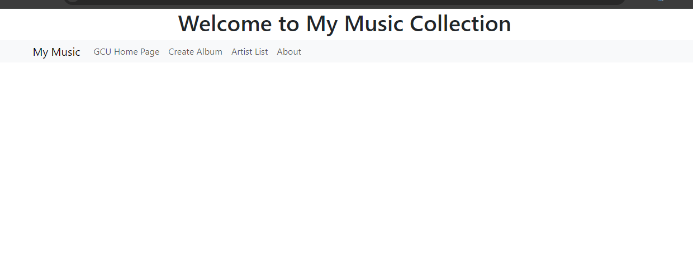
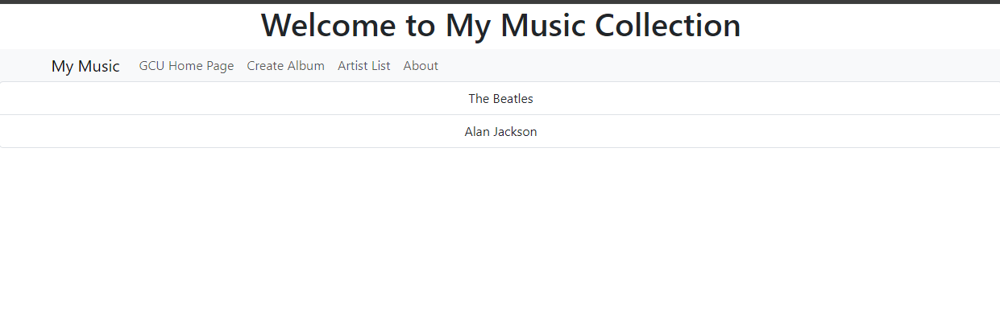
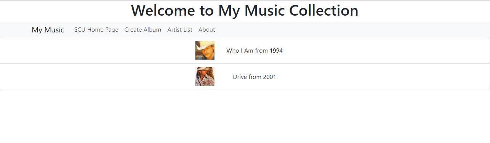
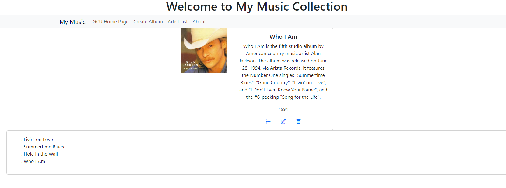
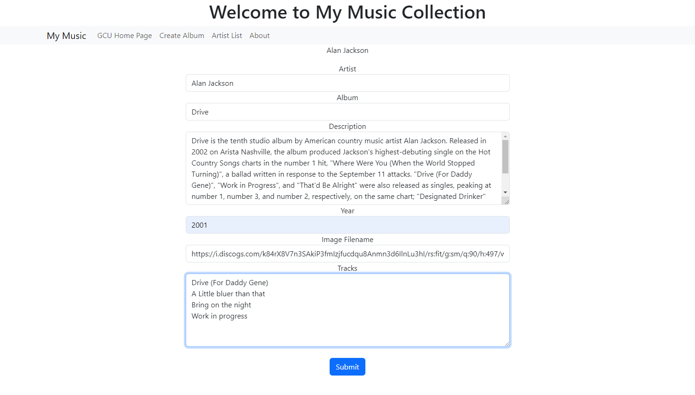
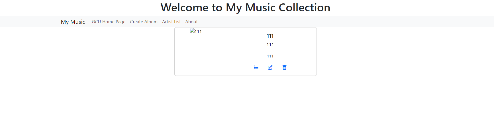
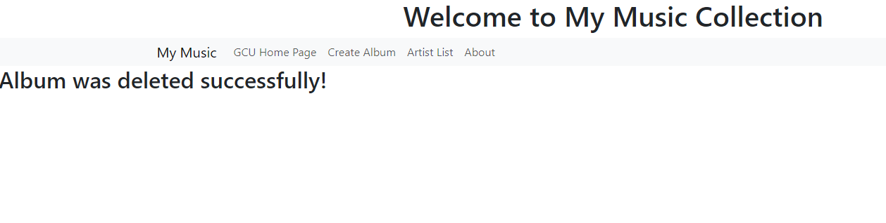
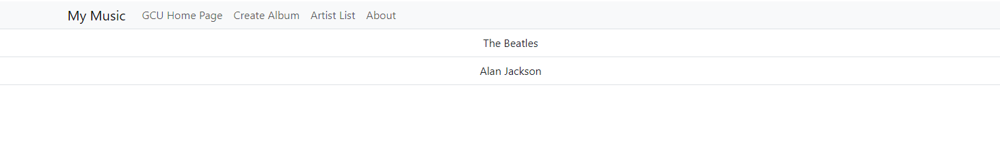

# Activity 4 Music Application 

## Executive Summary

### Part 1:
- In this activiy, Music App will be built by integrating the application with the back end services created in Topic 1. Which MAMP and Express Music app will be used to provide data set.

#### Music App Screenshots:

- This is the main screen of Music App which Bootstrap was used to styling it. 

- This screen displays the list of artist in the database. As it shows that this database include two artists.

- This screen displays the album list for artist. As it shows that this artist has two albums in album list.

- This screen shows the page that diaplay the album with rtucks.

- This screen shows the page that use to create a new album which by providing the album detials and cleck submit the new album will be added to album list.

- The tree screens above show the process of deleting an album from the database, which I create an album (for testing perpuse) and then by clicking the delete icon the album will be deleted and the message will be displayed.

### Research Questions:
#### 1-Research how an Angular application maintains a logged in state. How does it communicate this state to the server?
- Angular application maintains and manage a logged in state by using libraries such as:
**RxJS Observables:** this is one of the powerful libararis that provide a reactive programming approch. this library allows the developer to create pbservables thar represent streams of data, which will give the developer the ability to manage the state changes and propagate them to components efficiently. They can be combined, transformed, and subscribed to in different component to react to state change.

    **Angular Services:** this is a great method to manage state within an application. After the service was created and injected into components. The developer can centralize the state logic and make it accessible across multiple components, these services can hold the state and provide methods to modify the state and retrieving it. This is good for small application with moderate amond of state.

    **NgRx:** This library it is one of the most populer labrabraries to manage and maintains the state which is based on Redux principles. It has a good pattern for managing state by using actions, reducers, and selectors. NgRx centralizes the state management in a store, which it is suitable for large applications with complex state requirements.

    By using one of these methods or libraries to manage the state, and tracking the user states and using the HTTP request and response with the cookies the developer can manage the user athorization.

**- Resorces:**

Naser, S. (2023, June 23). Techniques to manage state in angular and witch one we should use. LinkedIn. https://www.linkedin.com/pulse/techniques-manage-state-angular-witch-one-we-should-use-salem-naser 
