# Activity 5 React Music Application 

## Executive Summary

### Part 1 React Music App :
- In this activiy, the React was used to build a music app. The Bootstrap "Card" was used with the CSS from bootsrapcdn.com. The  App.js, Index.js, and Card.js were created. the React was importet to all of them. In Card.js that include the cart component form Bootstrap which was modified to include properties by adding props parameter in the function and expot default method was used. The App.js both React and Card were imported, all the card properties were defined and filled out with information. In index.js React, ReactDom with both App and Card were imported and ReactDOM.render was used to fill the webpage with the information.

#### Screenshots:

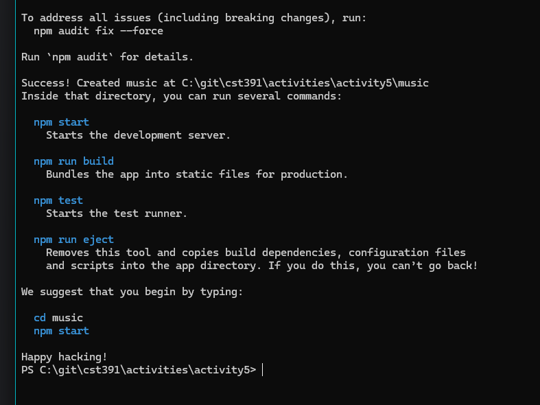
- This screen shows the terminal was used to install React and create a music app.

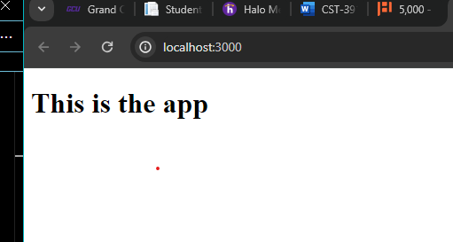
- This is the main screen of Music App using React. 

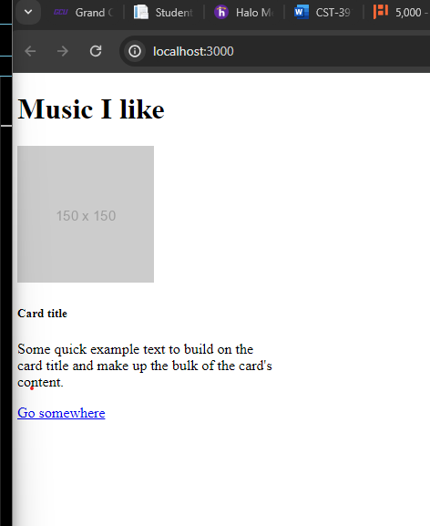
- This screen displays the music app page after adding card from bootstrap.

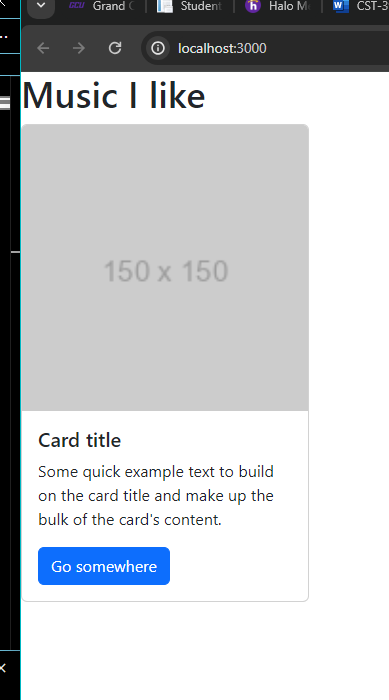
- This screen displays the page after adding CSS from bootstrapcdn.com.

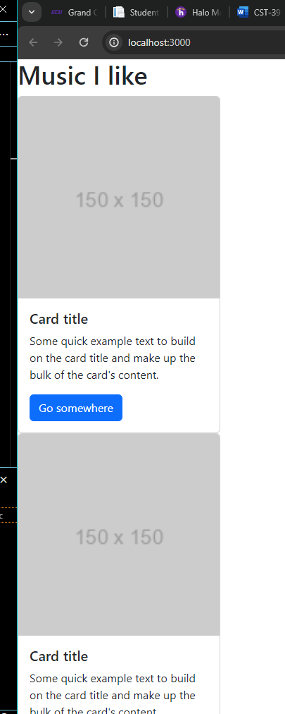
- This screen shows the page after creating Card.jd and adding three cards to it.

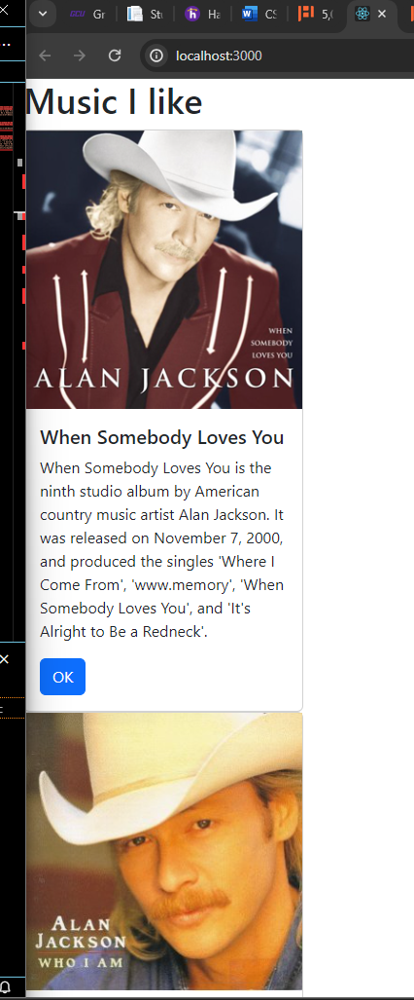
- This screen shows the webpage after creating the App.js and adding Album information to it.

### Mini App #1-State Changer Demo
- This Application is created to explain the use of state and properties (props), and methods that are used to update the state of an application. In this applicaton a method that take props and return React elemnts is used. React use hooks that are built into react libraried to manage the state changes, when user use actions like mouse click or keyboard the react use hooks to update the user interface when the change occurred.

#### Screenshots:

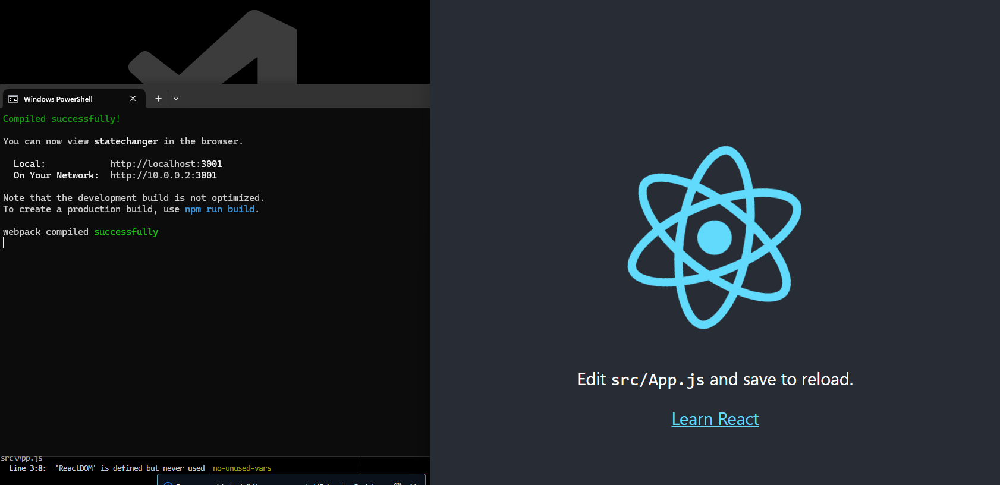
- This screen shows using terminal with npx create-react-app command.

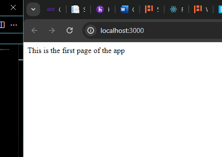
- This screen shows the application running after was created using npm start.

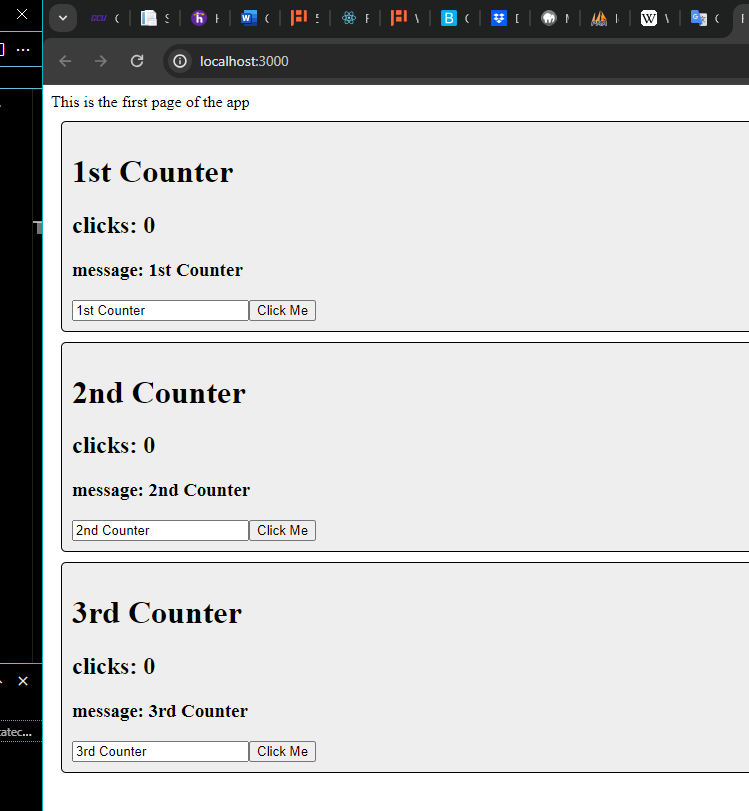
- This screen shows the application after creating Counter.js which include addOneClick() methods that count the click using onClick event in the button tag to be envoked and handleNewMessage() method that update the message with the message that user entred in input box and will update using onChange event.

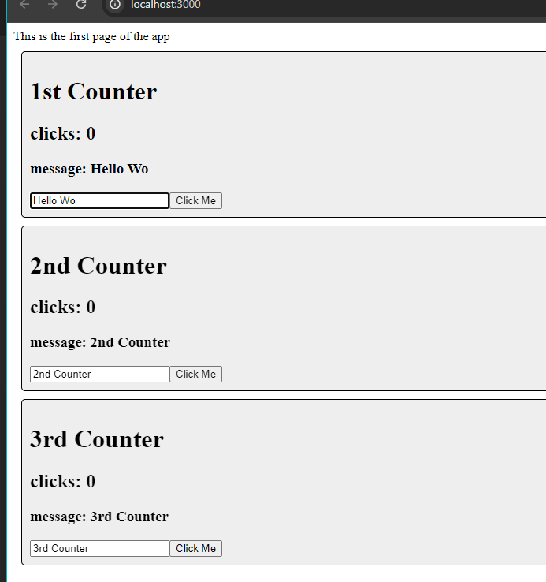
- This screen shows the update of message while the message field is getting updated as soon as the user in enter a letter.

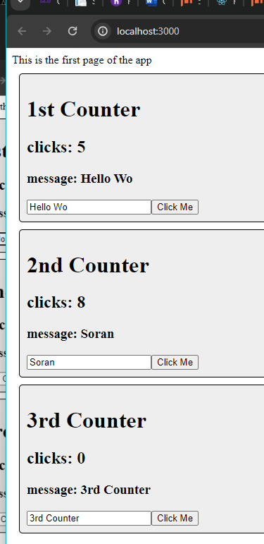
- This screen shows the increment in clicks numbers which the clicks is incremented by one whenever the user is clicking the Click Me button.

### Part 2 - Using State and Props in the Music Application
- This this part of activity the props, state, and event handlers were used to build and update the music app in part 1 of the actitvity. Where in the App.js the constant state variable named albumList is create, with the setAlbumList() function that will be used to update the album list later. renderedList() function is envoked in return statment in App.js, by using map() function, which is a transformation function, is used to loop over the albumList and transforms the albumList elements to JSX using Card component that has props (Properties). At the end the renderedList() funtion by using map() function returns a list of albums using Card element.

#### Screenshots:

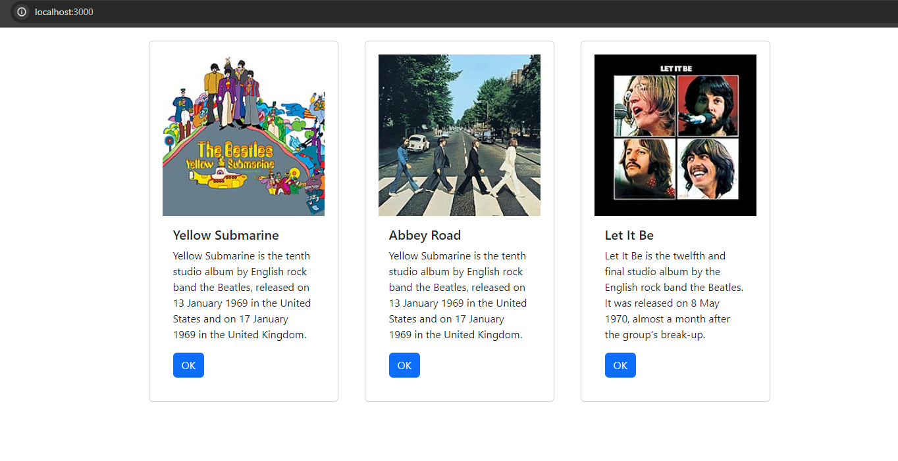
- This screen shows the music app page, that display three Beatels albums using Card element from Bootstrap and CSS from bootsrapcdn.com, with other CSS that were defined in separate css file.

