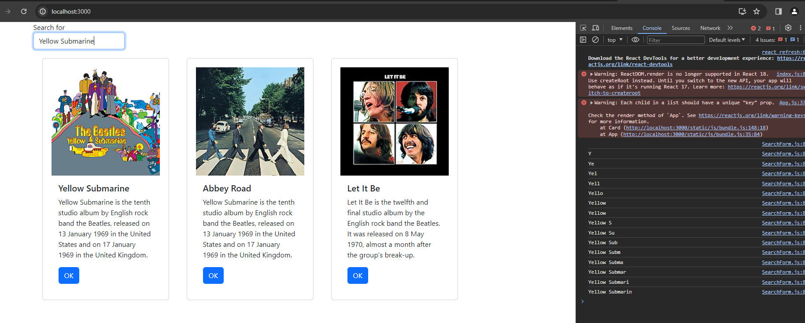
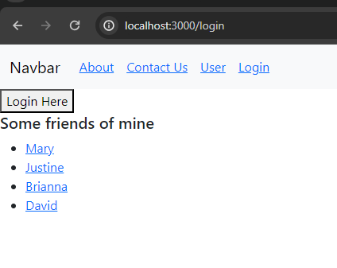
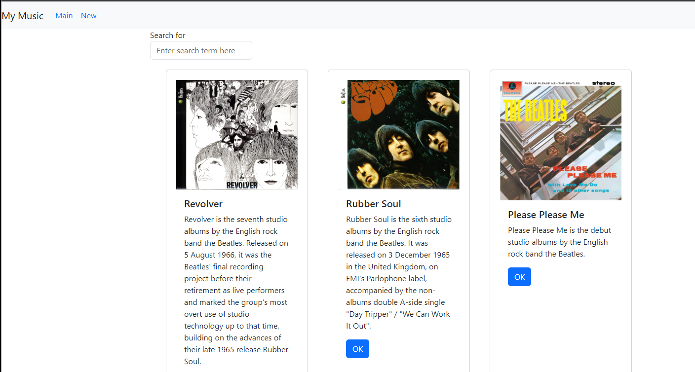

# Activity 6 React Music Application 

## Executive Summary

### Part 3 External Data Source :
- In this activity is extended for activity 5 (bulding a music app). This is the part three of activity. In this part we will use an external data source which Express Music app will be used as an external data source. In this part we create a JSON file and imported it to App.js. The useEffect is used in this part which by calling it, it provides a effect callback function, which are invoked during the life cycle when React found that it is safe to call functions that will generate side effect and which is where web service API is placed. Also search for album was create in this activity where album discription was used. Which will bring all albums that have a particulare word(s) in the discription. Also, Axios is used in this activity, Axios is a popular library whose job it is to fetch data from JSON formatted rest services. The Async and Await also are used in this activity which are used to fetch data from slow external sources.   

#### Screenshots:

- This screen shows the search bar location.

- This screen show the search bar when is being filed with search key which we can see that console is printing the search term letter by letter. 

- This screen shows the console output thet the search value was accepted and asigned to var called phrase.

### Part 3 - Mini App #2 - Routing Application Demo
- This Application will demenstrate the use of routing in React library. Which Route A web application route is a connection between the browser's URL and the contents of the web page. The app was create by using the command npx create-react-app router. Then several components that represent different pages were created. In this part of activity props.onClick was used which was called by handleLogin. Navigate, which is a ready-to-use method allowing the code to use routing to navigate to the next application page was used as well. also location was used that used to get location state.

#### Screenshots:

- This screen shows the main page of route app.

- This screen shows that the user is not able to display the about page until they log in.

- This screen shows the user page of route app.

- This screen shows the login page.

- This screen shows about the company page after that user loged in.

- This screen shows the page when the user clicked of one of the friends' name.

### Part 4 - Navigation Routing
- This this part of activity react-router-dom was used which was insralled using npm install react-router-dom. Also several chacges was made to the application from priveuse part which the search part was implemented and function which now the user can search for the album using description. The components such as BrowserRouter, Routes, and Route were imported and usen in this part. BrowserRouter is wrapper component for router components, Routes is parent component of an individual Route, while the Route defines an individual Route in the application. Also some new components were added to the applicatin such as NewAlbum, OneAlbum, SearchAlbum, and NavBar

#### Screenshots:

 
- This screen shows the final look of the music app with search bar which the user can now search for album using word(s) in album's description.

- This screen shows the search proccess which the user search for album in 1969 and the search results retuen two alboums.

