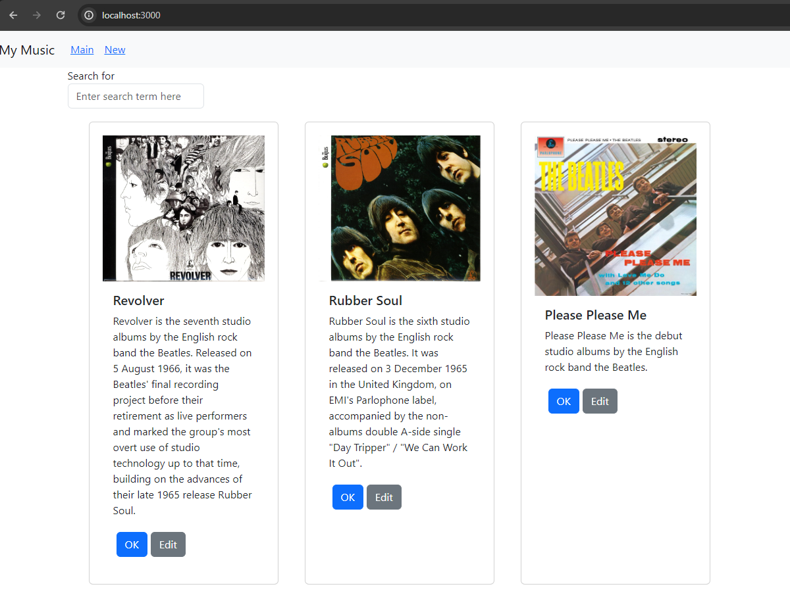
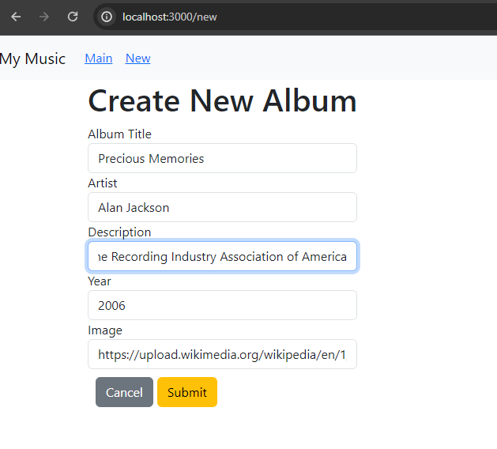
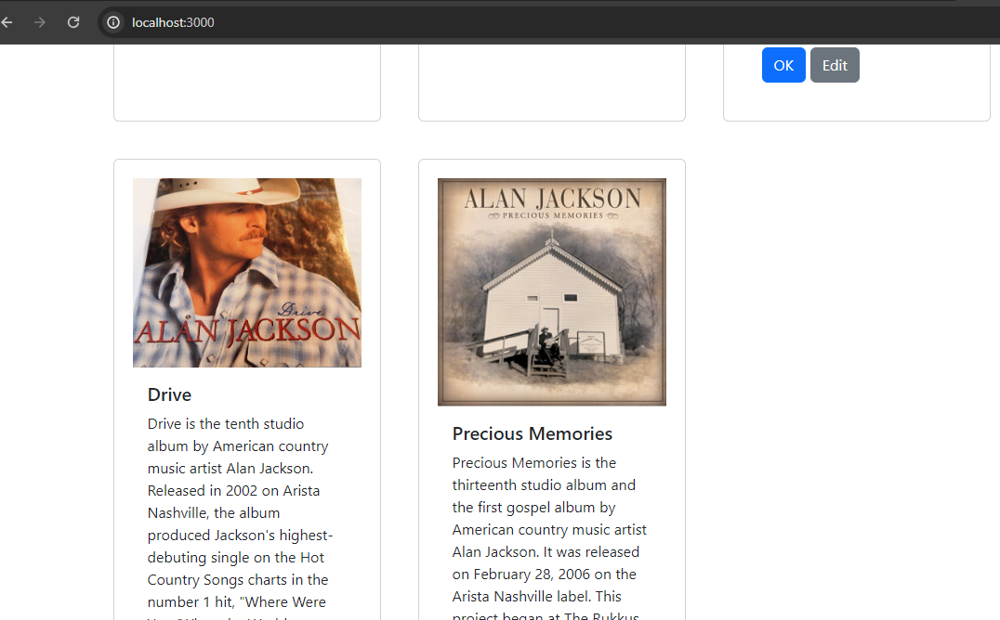
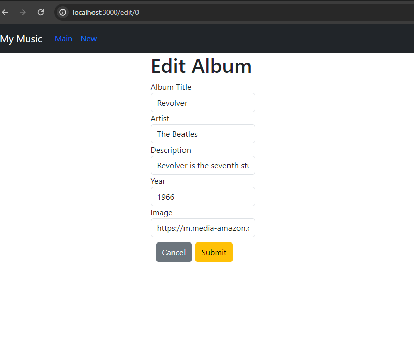
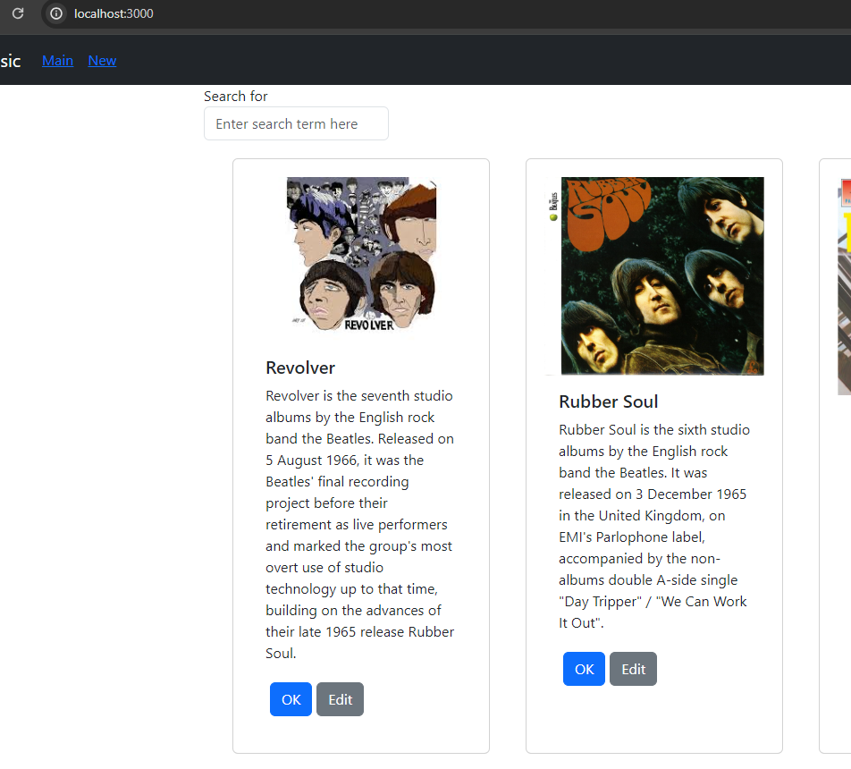
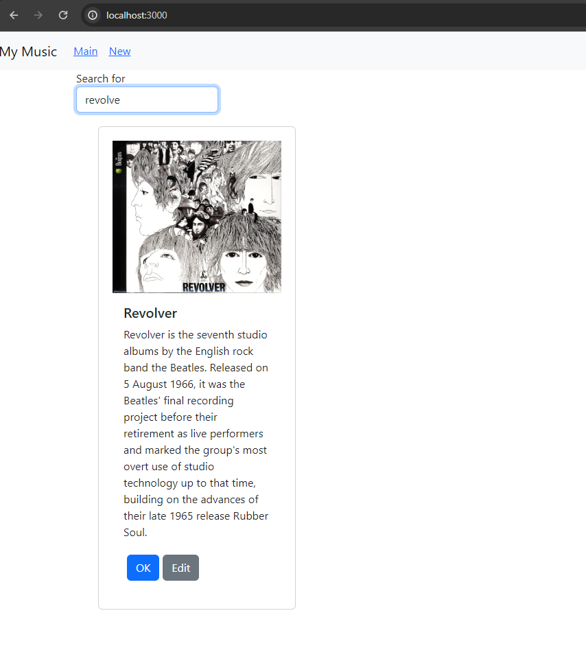

# Activity 7 React Music Application 

## Executive Summary

### Music App:
- In this activity is extended of activity 6 (bulding a music app). In this actitvity the option to create a dynamilcal new album was added. By using onChange event the value of each property will be update dynamaclly to the value or the text in the input box. and when click the submit button the handleFormSubmit() function will be called which create a new album and update the value and adds it to the database. then onNewAlbum() function will be called in the parent component "App.js" which will reloads all the albums and navigate the user to main page.
- then in the other part of the activity we upadata the NewAlbum component to an EditAlbum which will be used to both add new album and edit an existed album, which an if statment is used to check weather the album is new or an exist on. In it is a new album the placeholder value will be displayed in the input fields otherwice,the input fields will be filled by the value of an existed album.

### Pending Bugs:
- The bug that I have in this activity is related to album ID, for some resion it only get the first album in my database and the album ID is defined as zero (localhost:3000/edit/0) while in my database I do not have album that its id number is zero.
- The nav bar does not work as a drop list when resize the window to small size window
- After applying search the main in nav bar does not respond, it does not navigate the user to main.

#### Screenshots:

- This screen shows the main page that display all albums.

- This  screen shows the process of adding a new album, after submiting the form will navigate the user to the main page.

- This screen shows the main page after adding a new album.

- This screen shows the edit page when the user clicked the Edit buttom om album.

- This screen shows the main page after editing the album information, here I changed the album image. 

- This screen shows the search process.
