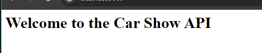
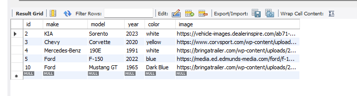
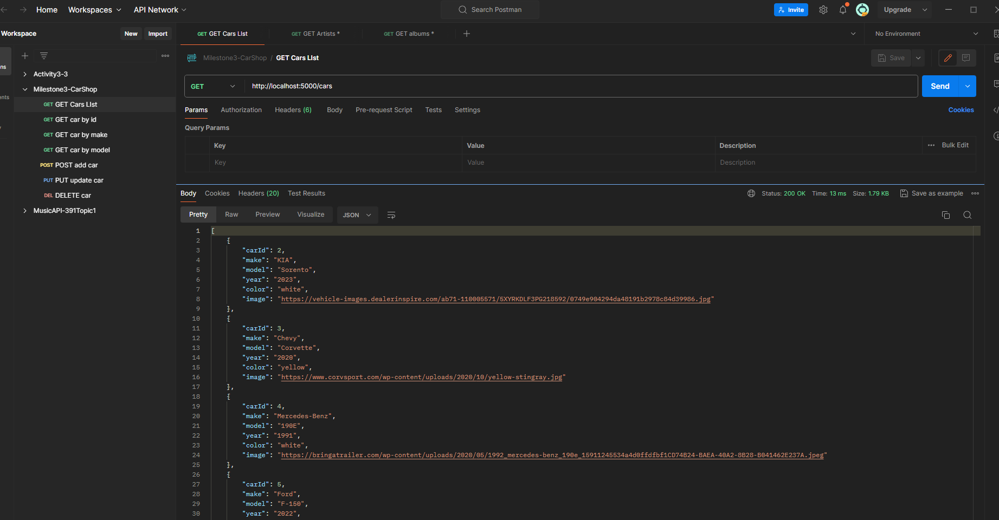
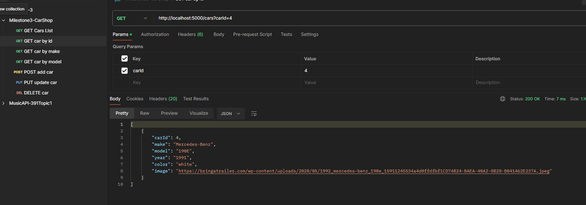
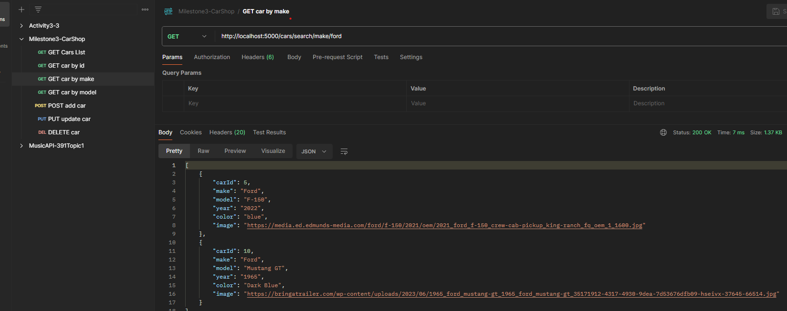
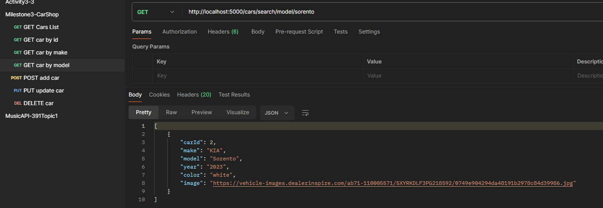
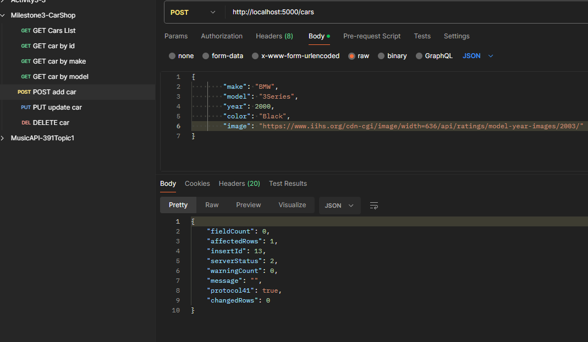
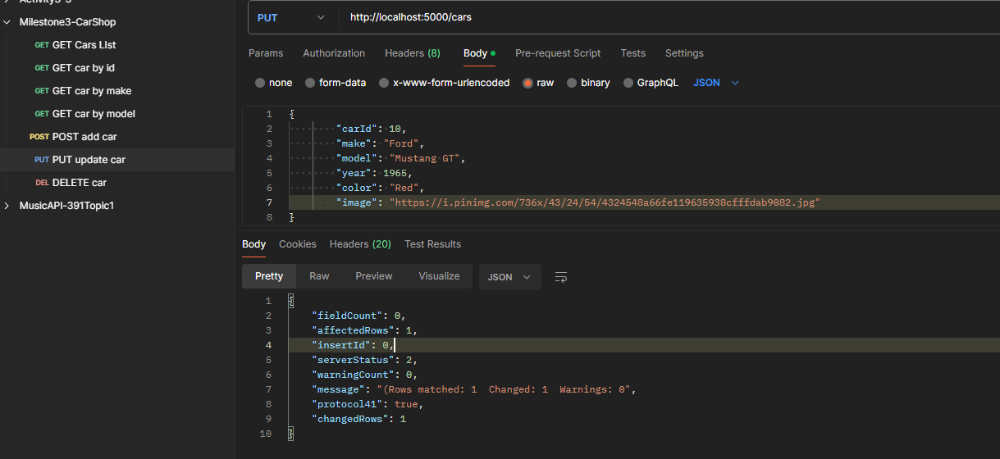
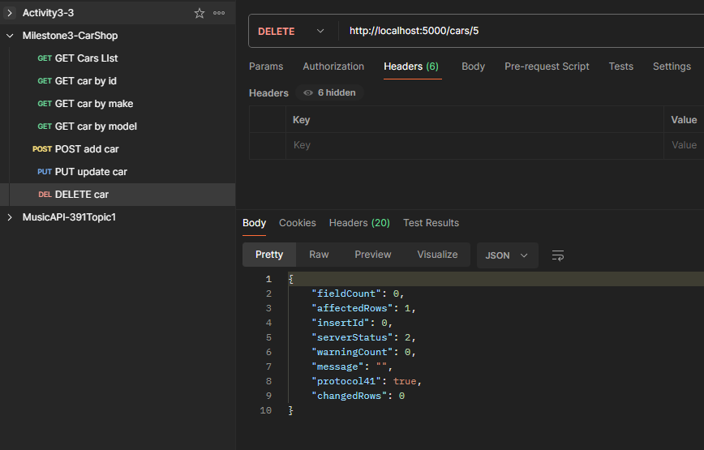
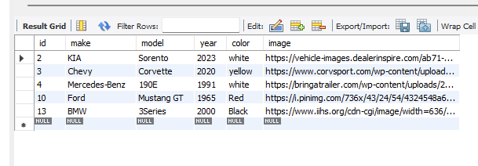

# Milestone 3

## Executive Summary

- This is a Car show API application that use JavaSpring which is used SQL queries, routes, model, dao, and controlers. The app is connect to mySQL service using IP address, port, username and passwors which are defined in .env file. 

## Databse:
- The database that I use is contains one table called cars which contains a list of cars. The table fields are car id, make, model, year, color, and an image.

## Application 

### Design Update
- Updated my design from pet store to car show.

### UML

- This is a new UML

### Challenges
- The first challenge that I faced while coding this program it was that the properties' (variables) name was not matched by my database and application, for example in database I name car Id and id, while in queries I was using car id. therefore, it is better to name the variable the same name wherever they exest.
- I was not able to update the an item in the table. the problem was I forgot to include a carId property to updateCar method in cars.dao.ts which took me time until I figured it out.
- Another mistake, typing mistake, that I did was adding comma in the sql quere for update query before where clause.

### Pending Bugs:
- There is no pending bugs.

### Lessons learned 
- Be more careful while typing because any small mistake could take hours to find it.
- Testing the code step by step and debugging is very helpful.

#### Screenshots

- This screen shows the welcome message of the Car Show API when the user open the web page using localhost:5000.

- This screen shows the cars list in mySQL database. Which it can be accessed by using URL localhost:5000/cars 

- This screen shows the selection of one car using car id. This can be access by typing the url loacalhost:5000/cars?carId=4

- This screen shows the selection of cars using make. This can be access by typing the url loacalhost:5000/cars/search/make/ford

- This screen shows the selection of cars using model. This can be access by typing the url loacalhost:5000/cars/search/model/corvatte

### Postman:

- This screen shows the database with all cars in car's table.

- This screen shows select all car from car's table.

- This screen shows select car by its ID.

- This screen shows select cars by its make.

- This screen shows select cars by its model.

- This screen shows adding a new car to the table.

- This screen shows the update of one car using Id. which the color of carID equal to 10 was changed from dark blue to red. (see the first and the last pictures).

- This screen shows the deletion of a car using car id, which car with id number equals to 5 was deleted.

- This screen shows the car's table after running all the queries.

#### Recording:

- Video1: https://www.loom.com/share/c4859d851eff4c5480a3b91b639846b9?sid=a72d3cfb-70dc-497a-9a94-6439841c42c8

- Video2: https://www.loom.com/share/1f39d7e2f3f24a5a960332976dd9cba7?sid=3e317ee2-0487-4384-a8c8-0d41f72e23ee 

- This is the vidoe of the Car Show API while running showing the web pages and the postman.

