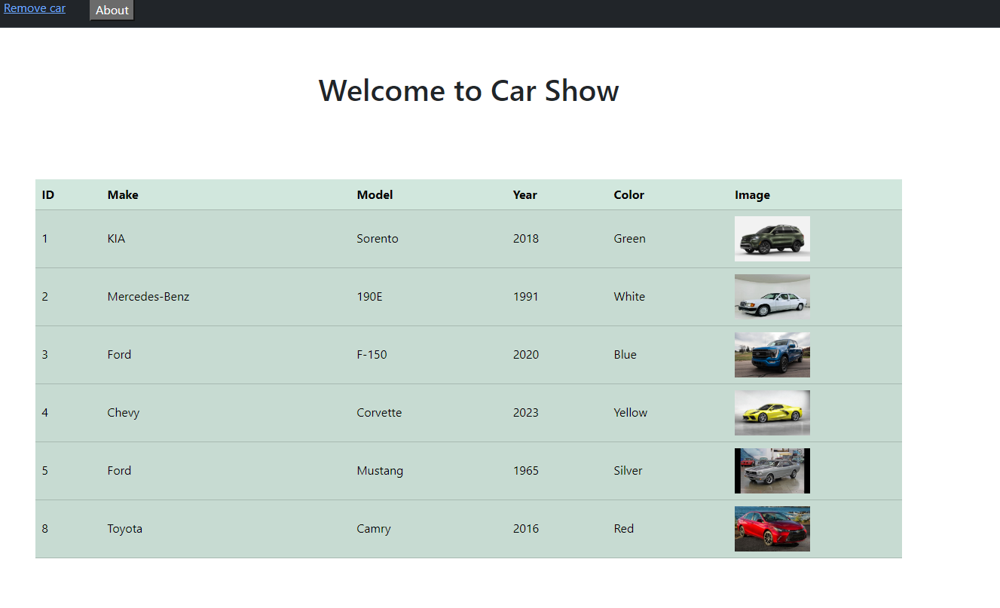
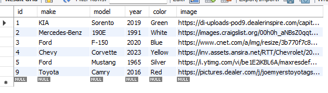

# Milestone 4

## Executive Summary

- This is a Car show API application (Milestone 4) that is build using Angular based on activity 4. MAMP is used for data access with Express framework by running Milestone 3 a side which is provide access to data that are stored in MAMP and MySQLWorkbenck

## Databse:
- The database that I use is contains one table called cars which contains a list of cars. The table fields are car id, make, model, year, color, and an image.

## Application 

### Design Update
- Updated my design from pet store to car show.

### UML

- This is a new UML

### Challenges
- The challenge that I had I was getting an error message that the constructor was missing arguments and this took me some time untile I figured out and the problem was that in create new item componenet (create-car.components.ts) I was using both Math.floor(Math.random() * 1000000) and carId.
- The other challange was I forgot that I have to run an Express build application which in this case is milestone 3 to get access to data that are stored in MAMP.

### Pending Bugs:
- There is no pending bugs.

### Lessons learned 
- Debugging is always the solotion to find the error.
- The programmer must be very careful while coding and should be focused.

#### Screenshots

- This screen shows the welcome message of the Car Show API when the user open the web page.

- This screen shows the cars list which the Boorstarp is used to styling the page.

- This screen shows the add new car page. Which form is used ti build this page with bootstrap.

- This screen shows message that the car was added successfully

- This screen shows The car list after adding a new car to the list.

- This is the update page that it uses to update the existing car in the list by using the car ID.

- This screen shows message that the car was updating successfully

- This screen shows the car list after updating a specific car in the list. Here, I update the year of the first car from 2018 to 2019

- This screen shows the remove car page which the car can been removed by providing the ID and click the remove button.

- This screen shows message that the car was removed successfully

- This screen shows the list after removing the car, which the last car was remmoved from the car list.

- The picture show the database before and after adding car to database.

### Postman:

- This screen shows select all car from car's list.

- This screen shows select car by its ID.

- This screen shows select cars by its make.

- This screen shows select cars by its model.

- This screen shows adding a new car to the table.

- This screen shows the update of one car using Id. Which the ford F-150 was replaced by ford fusion.

- This screen shows the deletion of a car using car id, which car with id number equals to 11 was deleted.

#### Recording:

    
- Video 1: https://www.loom.com/share/51a6965087504bbe81cae077935647c1?sid=9d868222-918c-4ae7-a2d1-b2ec3d8a9efc
- Video 2: https://www.loom.com/share/17780912178a4770a73845be86819fd8?sid=f1e31bb8-50c7-4ff3-9211-fa7cc8751c67

- This is the vidoe of the Car Show API while running showing the web pages and the postman.

